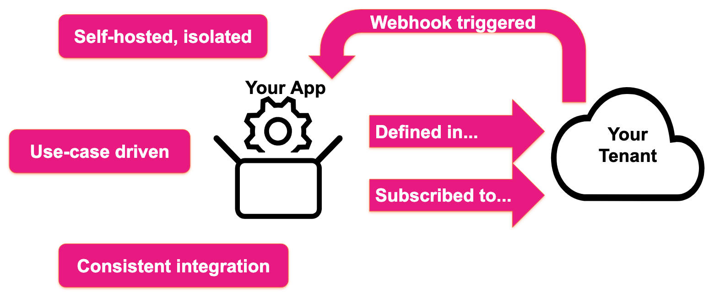
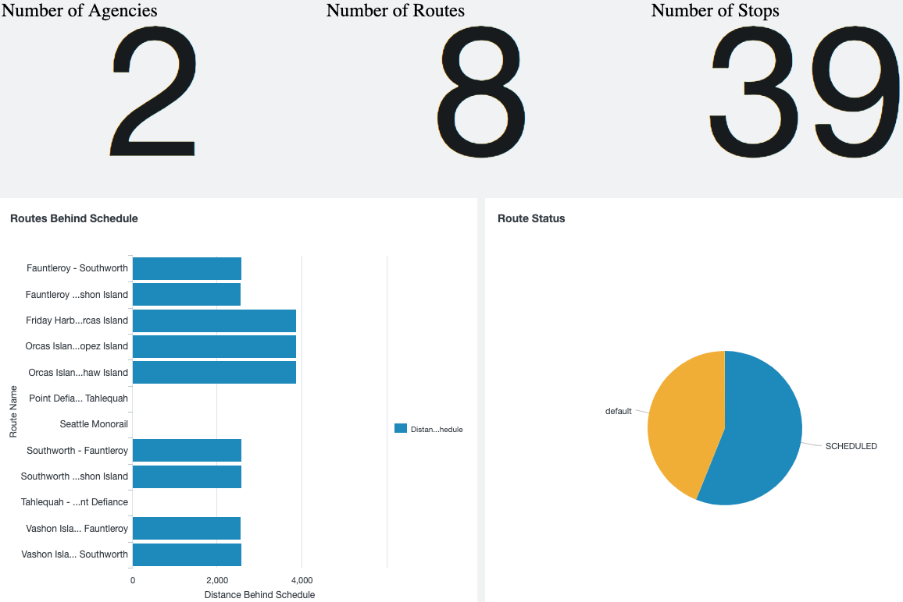

# Transit Dashboard App

This repository contains the code for the Transit Dashboard App, which uses Splunk Cloud Services to display a dashboard with transit route status by stop using data from Seattle Transit agencies. 

This readme describes how to set up and use the Transit Dashboard App: 
-  Key concepts and terminology of Splunk Cloud Services
-  Set up your environment
-  Log in to Splunk Cloud Services and use the APIs
-  Set up a tenant with a data pipeline
-  Get sample data in and out of your tenant
-  Define the app and create a subscription
-  Build and run the Transit Dashboard App

## Key concepts and terminology of Splunk Cloud Services

Splunk Cloud Services is a collection of services exposed via REST APIs to enable fast and flexible app development. 


The most fundamental concepts to understand for this sample app are the identities and their relationships.
- **Principals** represent an actor that makes API requests against Splunk Cloud Services.
  - Users, apps, and service accounts are kinds of principals.
- **Tenants** represent a way to contain and isolate the resources provided by Splunk Cloud Services.
  - Splunk Cloud Services is multi-tenant. There is no separate deployment per customer as with Splunk Enterprise.
  - API requests are all made in the context of a specific tenant.
- Principals are allowed to make API requests against a tenant only if there exists a **membership**.
  - The membership includes specific permissions granted to the principal within the tenant.

## Set up your environment

To ensure your local development environment is set up to successfully submit API requests, and to access and run code examples and applications, install the following tools:

- [Splunk Cloud Services CLI](https://staging.developer.splunk.com/scs/docs/overview/tools/tools_scloud), or `scloud`, is a command-line tool that makes it easy to submit API requests against Splunk Cloud Services. Download and unpack the `scloud` binary from [GitHub](https://github.com/splunk/splunk-cloud-sdk-go/releases).
- [cURL](https://curl.haxx.se/dlwiz/?type=bin) is a command-line tool that allows you to transfer data to or from a server. A number of example API requests on the Splunk Developer Portal make use of cURL. 
- [Git](https://git-scm.com/book/en/v2/Getting-Started-Installing-Git) is a source-code management tool that allows you to run commands to access projects and keep track of changes to application files.
- [Node.js](https://nodejs.org) is a JavaScript runtime environment that is required for a number of example applications accessed from the Splunk Developer Portal. NodeJS version 8.3.0 or later is required for this app. 
- [npm](https://www.npmjs.com/) is package manager that makes it easy for programmers to publish and share source code of Node.js libraries.
  - The npm client is installed with Node.js. 
  - Log in to npm (run `npm login`) before running `npm` or `npx` commands.
- [Yarn](https://yarnpkg.com/en/docs/install) is a package manager that enables additional workflows for JavaScript applications. Yarn is used to install packages and run commands in the Transit Dashboard App. Yarn version 1.3.2 or later is required for this app.

### Clone the repo

1. Create a folder on your computer for the project files.

2. At the command line, navigate to the folder and run the following command to clone this repo: 

    ``` 
    $ git clone https://github.com/splunk/conf19-scp-workshop
    ```

## Log in to Splunk Cloud Services and use the APIs

To get started with Splunk Cloud Services, sign in to [Splunk Investigate](https://si.scp.Splunk.com) with your Splunk account and accept the Terms Of Service. 

You can use the Splunk Cloud Services APIs in different ways, depending on your preference. Here are a couple of different ways to get information about your principal and see the tenants you are a member of.

### Use the API Reference Console to explore the APIs 

The API Reference Console is similar to using a Postman collection, allowing you to make Splunk Cloud Services REST API requests using pre-defined forms and view the formatted results. 

<kbd></kbd>

1. Log into the [Splunk Developer Portal](https://developer.splunk.com/scs) with your Splunk.com credentials.
2. Navigate to the [API Reference](https://developer.splunk.com/scs/reference/) page.
3. Select **Identity** from the list of services on the left, then click the [`GET /principals`](https://developer.splunk.com/scs/reference/api/identity/v2beta1#endpoint-listPrincipals) endpoint.
4. In the main window under the endpoint, click **Console**. 
5. Click **Show** to reveal your **Authorization token**.
   
   Each API request requires a valid token, for example, when using cURL directly. Because you are logged into the Splunk Developer Portal, your access token is automatically applied to requests.

   - Copy the token value and store it for later use.

6. Click **Submit** to make the API request to return your principal name. 

   - Copy the value of the principal name that is displayed for use in the next API request.

7. Under **Identity** from the list of services on the left, click the [`GET /principals/{p}`](https://developer.splunk.com/scs/reference/api/identity/v2beta1#endpoint-getPrincipal) endpoint.
8. In the main window under the endpoint, click **Console**. 
9. Enter your principal name copied from step 6 in the form field.
10. Click **Submit** to make the API request to display details about your principal account.

    Each API request will need to target a specific tenant. From the response, copy the value in the `tenants` array and store it for later use.

### Use the Splunk Cloud Services CLI to explore APIs 

For a more programmatic approach, use `scloud` at the command line to explore the Splunk Cloud Services APIs. 

To log in at the command line, enter:

```
$ scloud -u <YOUR-PRINCIPAL-NAME> login
```

To get details about your user account (your principal), enter:

```
$ scloud identity get-principal <YOUR-PRINCIPAL-NAME>
```

## Set up a tenant with a data pipeline

All incoming data moves through the Splunk Data Stream Processor (DSP). Data from REST APIs or Splunk Forwarders first flows through the Splunk Firehose. The Firehose aggregates your data into a single stream. From there, your data goes through a data pipeline where you can perform complex transformations and troubleshooting on your data before sending it to your indexers for searching.

Indexes are defined as kind of dataset managed by the Catalog service, along with other datasets such as search job or kvstore lookup. Datasets are knowledge objects that contain data that can be read or written to.

After events are indexed, they can be searched through an updated and refined Splunk Search Processing Language (SPL2). SPL2 uses a natural grammar that more closely resembles SQL. All the same `stats` and `eval` functions are still there, to allow you to create visualizations.


Before data can be ingested, your tenant must have a pipeline defined and activated to process the events. For this app, create a simple passthrough pipeline that reads events from the Splunk Firehose and writes them to the "main" index. 

To create a passthrough pipeline, enter the following `scloud` commands:

```
$ scloud set tenant <YOUR-TENANT-NAME>

$ scloud streams compile-dsl -dsl-file passthrough.dsl > passthrough.upl

$ scloud streams create-pipeline -name passthrough -bypass-validation true -data-file passthrough.upl
```

Make note of the `id` (the one that is returned underneath the `description` field). You'll need it for the next command.

To activate the pipeline: 

```
$ scloud streams activate-pipelines <PIPELINE-ID>
```

## Get sample data in and out of your tenant
    
Once you have an activated pipeline, you can start sending events to your tenants using the Ingest service. 

This repo includes two JSON files with sample data from Seattle transit agencies containing service and arrival/departure data for routes provide during a set period of time. 

Run the following `scloud` commands to ingest the sample data files.

On *nix:

```
$ tail agencies-with-coverage.json \
    | scloud ingest post-events \
        -host localhost \
        -source agencies_with_coverage_json \
        -sourcetype json_no_timestamp \
        -format raw

$ tail arrivals-and-departures.json \
    | scloud ingest post-events \
        -host localhost \
        -source arrivals_and_departures_json \
        -sourcetype json_no_timestamp \
        -format raw
```

On Windows: 

```
more arrivals-and-departures.json | scloud ingest post-events -host localhost -source arrivals_and_departures_json -sourcetype json_no_timestamp -format raw

more agencies-with-coverage.json | scloud ingest post-events -host localhost -source agencies_with_coverage_json -sourcetype json_no_timestamp -format raw
```

### Explore the data through search

After ingesting and passing the sample data through the pipeline, the data is indexed and available for search.

Run the following commands to search the sample data files to see how many routes are currently active for each transit agency.

On *nix:

```
$ scloud search "| from index:main where source=\"arrivals_and_departures_json\" \
    | stats count() as refCount \
    by 'data.references.agencies{}.name'" \
      -earliest 0 \
      -latest now
```

On Windows: 

```
scloud search "from index:main where source=\"arrivals_and_departures_json\" | stats count() as refCount by 'data.references.agencies{}.name' " -earliest 0 -latest now
```

### Use Splunk Investigate to get data in

Go to [Splunk Investigate](https://si.scp.splunk.com/), select a tenant, click **Data**, then **Add Data** for wizards to help you get data in, set up and configure pipelines, and preview live data streaming into your pipeline!

**Note:** After data has been ingested, you can see the number of events passing through each node in your pipeline.


## Define the app and create a subscription

A quick overview of apps in Splunk Cloud Services:

-  **Apps** are self-hosted and run in isolation from Splunk Cloud Services. This model is different from Splunk Enterprise, where apps are installed to run alongside Splunk Enterprise. 
-  **Apps** are use-case driven, where the use case doesn’t have to be about Splunk: apps use Splunk Cloud Services to solve problems. 
-  **Apps** are developed with consistent integration points to Splunk Cloud Services. Apps all use the same APIs to configure, run, and develop apps.
-  **Subscriptions** represent an authorization grant between an app and a tenant, and are required before any API requests can be made. Every subscription results in a webhook call back to the app, so that the app knows it can start.



To define the app and create a subscription with your tenant: 

1. Create the app with a unique name and title.

    Apps are defined in a "home tenant" so that Splunk Cloud Services knows about metadata such as name, description, required permissions, and webhooks that get triggered on subscription events.

    **Note:** App names and titles are unique across all tenants, so for this sample app, replace `<TENANT>` below with your tenant name.

    ```
    $ scloud appreg create-app transit.demo.<TENANT> web \
        -redirect-urls http://localhost:3000 \
        -login-url https://auth.scp.splunk.com \
        -title "Transit Dashboard Demo App for <TENANT>" \
        -description "Copy of the transit dashboard demo app"
    ```

    Make note of the `<CLIENT_ID>` that is returned. You'll need it when configuring the Transit Dashboard App.

2. Create a subscription between your tenant and the app

    ```
    $ scloud appreg create-subscription transit.demo.<TENANT>
    ```

## Build and run the Transit Dashboard App

The Transit Dashboard App is a simple dashboard that displays transit route status by stop used by Seattle Transit. 



To build and run the app: 

1. At the command line, navigate to this `transit_dashboard_app` folder. 

```diff
REMOVE THIS STEP WHEN @splunk/dashboard-* GET RELEASED PUBLICLY:
npm config set @splunk:registry https://repo.splunk.com/artifactory/api/npm/npm-solutions-local/

```

2. Install the dependencies by running the following command: 

    ```
    $ yarn
    ```

3.  In the **./src/config/config.json** file, update the following values: 
    * Replace `YOUR CLIENT ID` with your client ID.
    * Replace `YOUR TENANT ID` with your tenant name.

4.  Start the example app in develop mode: 
    
    ```
    $ yarn run start
    ```

5.  In a browser, open `localhost:3000` to view the app.

## Resources

For more information about Splunk Cloud Services, see the [Splunk Developer Portal](https://developer.splunk.com/scs/).

For more about the tools that were used to build this app, see: 
- [Splunk Cloud Services SDK for JavaScript](https://developer.splunk.com/scs/docs/overview/sdctools/tools_jssdk/), which uses JavaScript to communicate with the Splunk Cloud Services REST APIs.
- [Splunk Cloud Services Auth component](https://developer.splunk.com/scs/docs/overview/tools/tools_cloud-auth), which provides a UI for users to authenticate with Splunk Cloud Services.
- [Dashboard Framework](https://developer.splunk.com/scs/docs/dashviz), which contains a framework for working with dashboards and visualizations.
- [Create React App](https://github.com/facebook/create-react-app), for bootstrapping this app.
